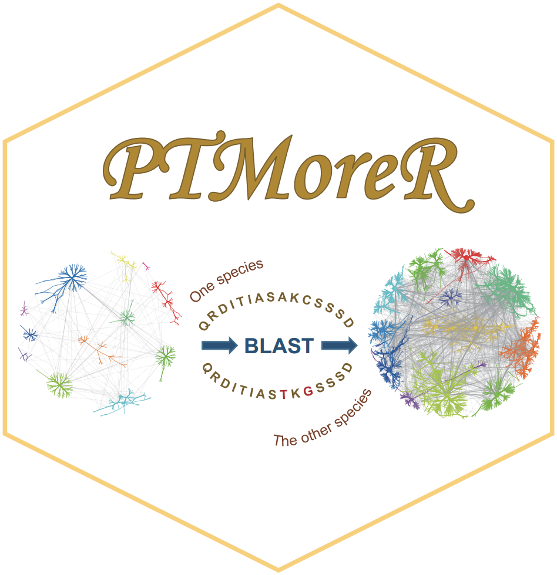
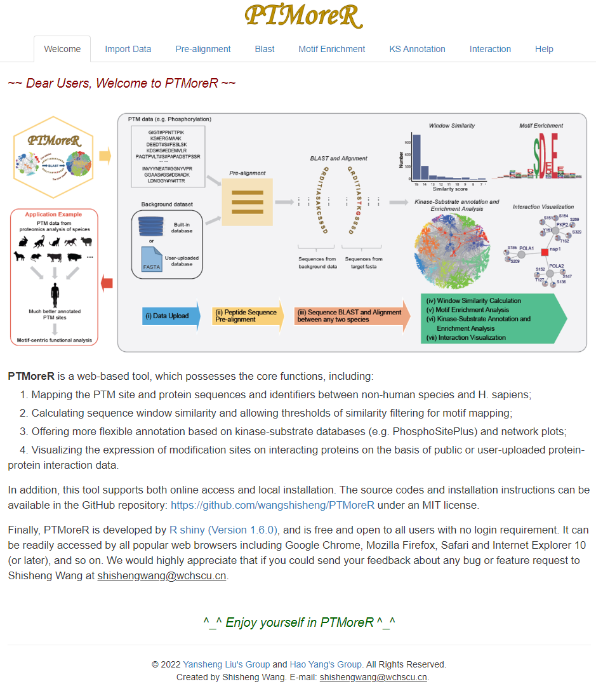

# PTMoreR
PTMoreR enables a motif-centric proteomic mapping and annotation of post-translational modifications across mammalian species

## Brief Description
**<font size='5'> PTMoreR </font>** (**P**ost-**t**ranslational **m**odification **or**tholog align**er**) is a web-based and stand-alone toolfor PTM researchers and proteomics society. PTMoreR is not merely a phosphosite BLAST tool; instead, it considers the surrounding amino acid sequence of PTM sites during BLAST, enabling a motif-centric analysis across species. Additionally, PTMoreR supports a swift site-specific functional enrichment and network analysis benefiting from the well-characterized human PTM proteomic datasets. This software (online version) is available here: [https://yslproteomics.shinyapps.io/PTMoreR](https://yslproteomics.shinyapps.io/PTMoreR). **Please note**: If the data are too large, we recommend users to intall this tool locally. Local installation can be found below.

## Graphical Abstract


## How to use
A detailed introduction of this software can be found in the [Supplementary Notes](https://github.com/wangshisheng/PTMoreR/blob/main/SupplementaryNotes.pdf).

## Run it locally
This tool is developed with R, so if you want to run it locally, you may do some preparatory work:  
**1. Install R.** You can download R from here: [https://www.r-project.org/](https://www.r-project.org/).  
**2. Install RStudio.** (Recommendatory but not necessary). You can download RStudio from here: [https://www.rstudio.com/](https://www.rstudio.com/).  
**3. Check packages.** After installing R and RStudio, you should check whether you have installed these packages (shiny, shinyjs, shinyWidgets, shinyBS, DT, data.table, openxlsx, Biostrings, GenomicFeatures, rtracklayer, stringi, stringr, ggsci, ggplot2, ggrepel, msa, tidyr, ggraph, graphlayouts, scales, impute, igraph, scatterpie, plotfunctions, mapplots, devtools, KinSwingR). You may run the codes below to check them:  

```r
if(!require(pacman)) install.packages("pacman")
pacman::p_load(shiny, shinyjs, shinyWidgets, shinyBS, DT, data.table, openxlsx, Biostrings, GenomicFeatures, rtracklayer, stringi, stringr, ggsci, ggplot2, ggrepel, msa, tidyr, ggraph, graphlayouts, scales, impute, igraph, scatterpie, plotfunctions, mapplots, devtools, KinSwingR)
#Then install some packages from GitHub, as below:
devtools::install_github("drostlab/metablastr", build_vignettes = TRUE, dependencies = TRUE)
install.packages("https://github.com/wangshisheng/motifeR/raw/master/rmotifx_1.0.tar.gz", repos = NULL, type = "source")
install.packages("https://github.com/wangshisheng/motifeR/raw/master/ggseqlogo_0.1.tar.gz", repos = NULL, type = "source")
```

If the preparatory work has been done, you can run this tool locally as below:
```r
if(!require(PTMoreR)) devtools::install_github("wangshisheng/PTMoreR")
library(PTMoreR)
PTMoreR_app()
```

**Please note**, as there are many databases from different species, this package is large. If you have some issues when you install it using the code above, _please try download it into your own computer and install locally_. And please also feel free to write an issue or e-mail to me if you have any problem about this software.

Then motifeR will be started as below:

<br>

## Friendly suggestions
1. Open PTMoreR with Chrome, Mozilla Firefox, Safari or Firefox.
2. The minimum operating system specifications are: **RAM 4GB, Hard drive 500 GB.**
3. The monitor resolution (>= 1920x1080) is better.

## Contact
You could push an issue on this github. And optionally, please feel free to sent me an e-mail if you have any question or find a bug about this tool. Thank you^_^
Email: shishengwang@wchscu.cn.


